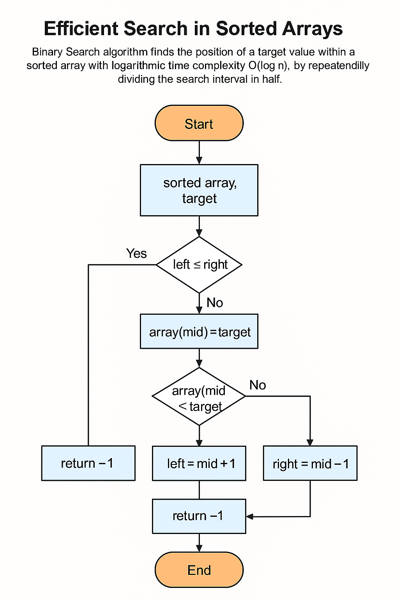

# Algorithm and Data structure usign Java

- Array functions
- Linear search
- Binary search
- O(n^2)

```sh
java com/multividas/LinearSearch.java
```

Output
```sh
~$java com/multividas/LinearSearch.java
Element 1829 found at index 1828
Execution time: 36186 nanoseconds

~$java com/multividas/BinarySearch.java
Element 1829 found at index 1828
Execution time: 3106 nanoseconds
```

## BinarySearch



Running Main.java
```sh
javac com/multividas/*.java
java com/multividas/Main.java
```

